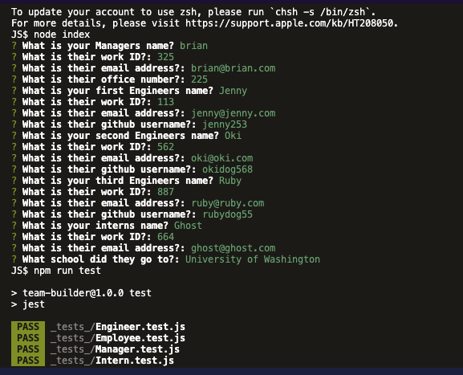
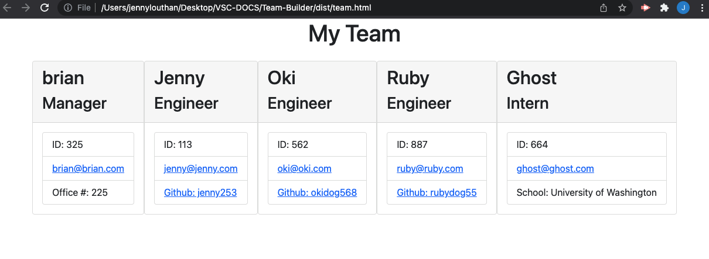

# Team-Builder
## <Project Team Builder>

## Table of Contents 

* [Description](#description)

* [Installation](#installation)

* [Technologies Used](#technologies)

* [LinkToSite](#LinkToSite)

* [Questions](#questions)

## Description

We were tasked with building a Node.js command-line application that takes in information about employees of a software engineering team. Once the user has inputed the information through our prompted questions, an HTML webpage is generated that displays a summary for each person. We are to run tests on the code to make sure that it is functioning. Lastly, you will find a video that demonstrates this functioning, below. 

## Installation 
You will need to install the dependencies, the inquirer package, jest package, run 'npm install' in your command line. Then to prompt the questions, use the command:
'node index.js'
To run the tests use the command:
'npm run test'

## Technologies
node.js, inquirer package, jest package

Below is an example of what the HTML webpage out will look like based on your inputs:
 
 

 

## Link to Github
<https://github.com/jennyrae818/Team-Builder-App>

## Link to Walk-through Video 
<https://drive.google.com/file/d/1O3vGRvnpN01PrBvD6S6P700PDx2kkkz2/view>

## Questions

If you have any questions about the repo, open an issue or contact [jenny](undefined) directly at jennyrae818@gmail.com.